# Documentacion
**Práctica: Despliegue de un servicio de monitorización**
Instalar y configurar uno de los siguientes servicios de monitorización (uno de los siguientes asignado por el profesor: Icinga, Nagios, Zabbix) en una MV con Ubuntu y monitorizar lo siguiente:

Creamos una máquina virtual en Linux y para asignar el servicio de monitorización Icinga debemos de:

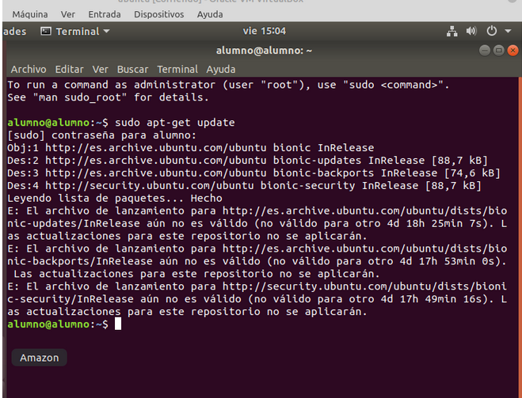

- Actualizar la máquina.

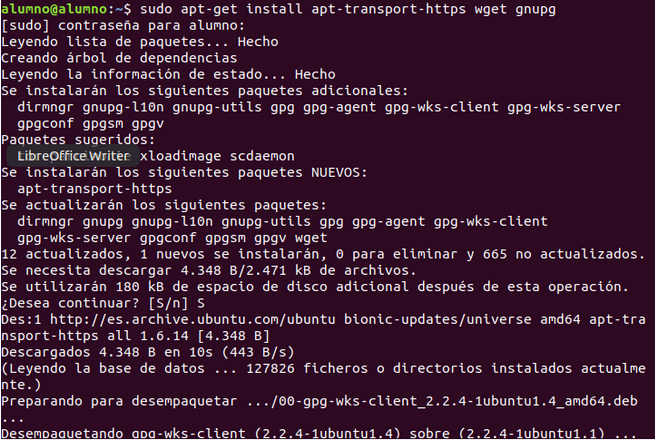

- Descargue e instale la clave del repositorio Icinga2.

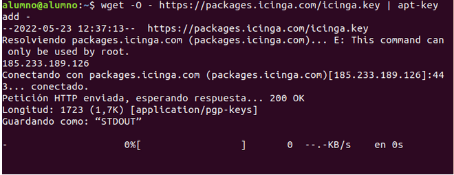

- Utilice el siguiente comando para descubrir su nombre de código Ubuntu linux.

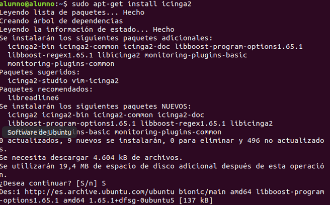

- Instalamos el **Icinga**

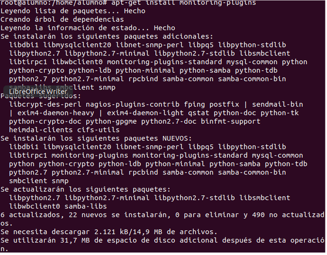

- Instalamos los plugins de monitoreo estándar del Icinga2 y habilitamos el **Icinga2**

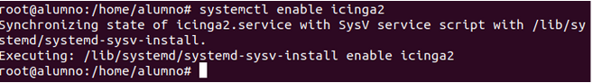

- Instalamos el paquete icinga2-ido-mysql.

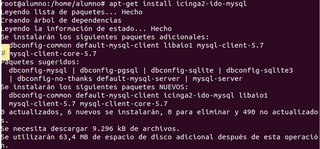

- Habilitar la función ido-mysql del Icinga 2.

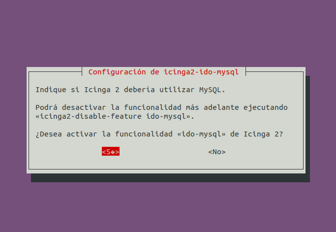

- Debemos escoger el no en la configuración “dbconfig-common”

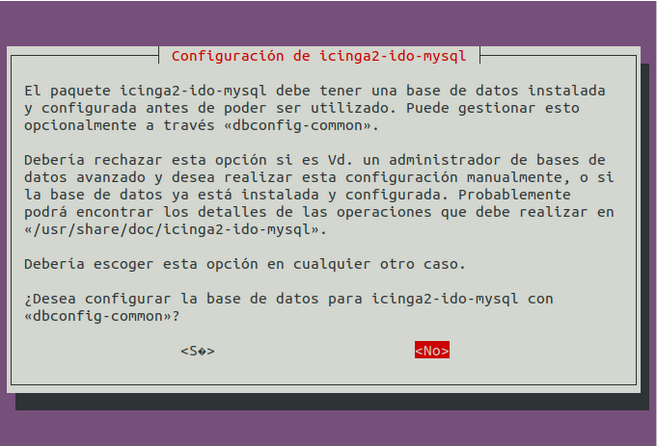

- Habilitar la característica ido-mysql.

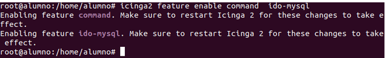

- Reiniciar Icinga2 e Instalamos el servicio de base de datos 
MySQL.

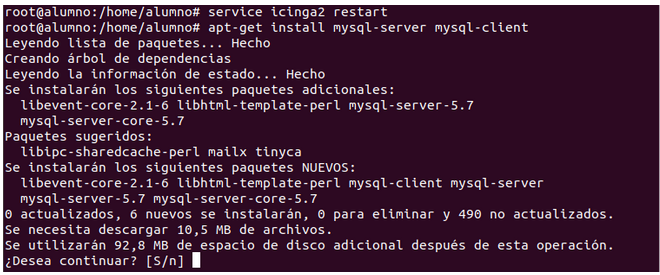

- Acceder al servidor de bases de datos 

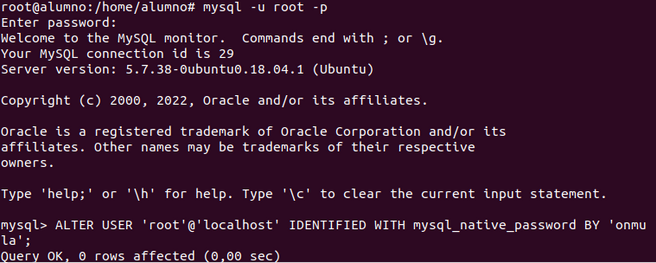

- Creamos la base de datos y un usuario

- Le damos todos los privilegios

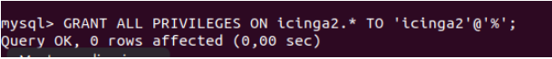

- Con el nano modificamos el archivo de configuración ido

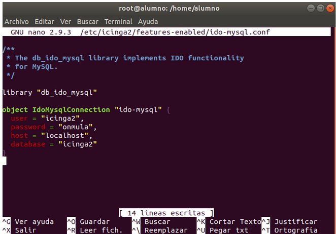

**Aclaración**:  *Mi guía continua en estos enlaces*

[Como configurar la base de datos Icinga Web 2](configurar-Icinga-web.md)

[Monitorización del equipo](Recursos.md)
