# Documentacion
**Práctica**: Despliegue de un servicio de monitorización
Instalar y configurar uno de los siguientes servicios de monitorización (uno de los siguientes asignado por el profesor: Icinga, Nagios, Zabbix) en una MV con Ubuntu y monitorizar lo siguiente:

Creamos una máquina virtual en Linux y para asignar el servicio de monitorización Icinga debemos de:

Actualizar la máquina.

Descargue e instale la clave del repositorio Icinga2.

Utilice el siguiente comando para descubrir su nombre de código Ubuntu linux.

Instalamos el Icinga

Instale los plugins de monitoreo estándar del Icinga2.

Habilitamos el Icinga2

Instalamos el paquete icinga2-ido-mysql.

Habilitar la función ido-mysql del Icinga 2.

Debemos escoger el no en la configuración “dbconfig-common”

Habilitar la característica ido-mysql.

Reiniciar Icinga2 e Instalamos el servicio de base de datos 
MySQL.

Acceder al servidor de bases de datos 

Creamos la base de datos y un usuario

Le damos todos los privilegios

Con el nano modificamos el archivo de configuración ido

**Como instalar la web de icinga2**

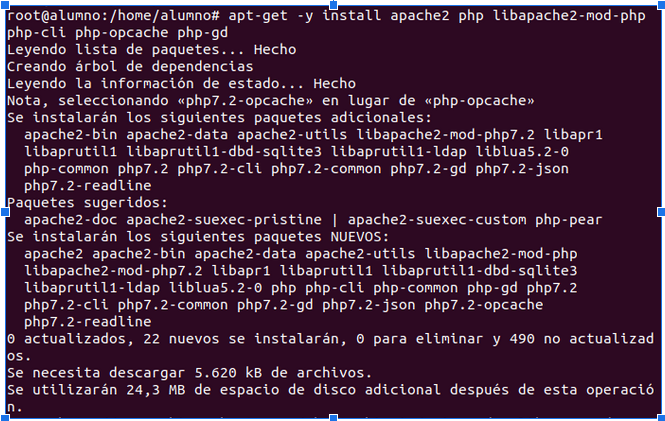

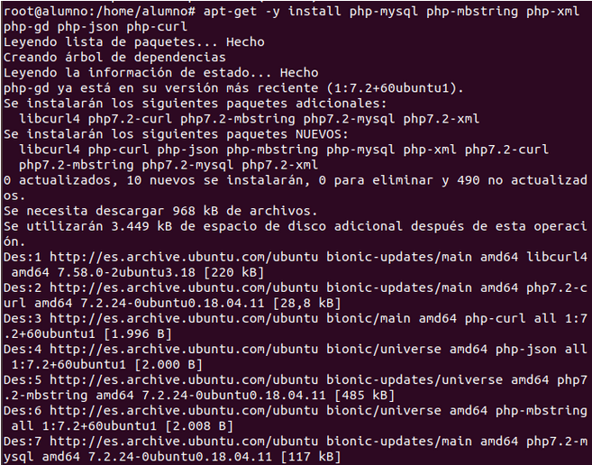

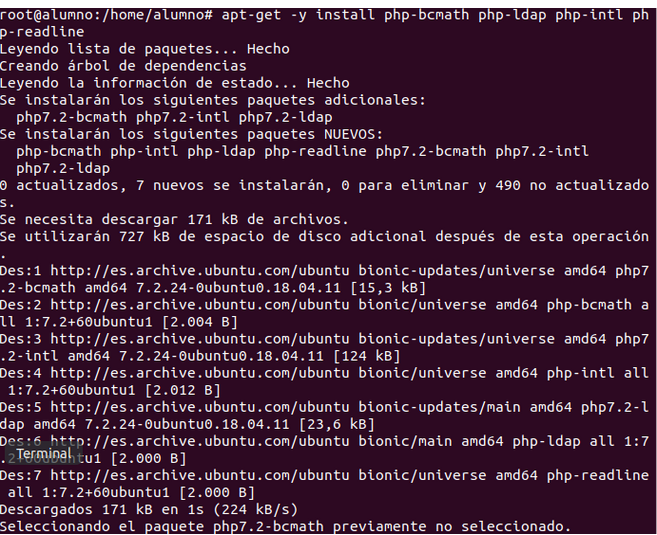

Instalamos la página web

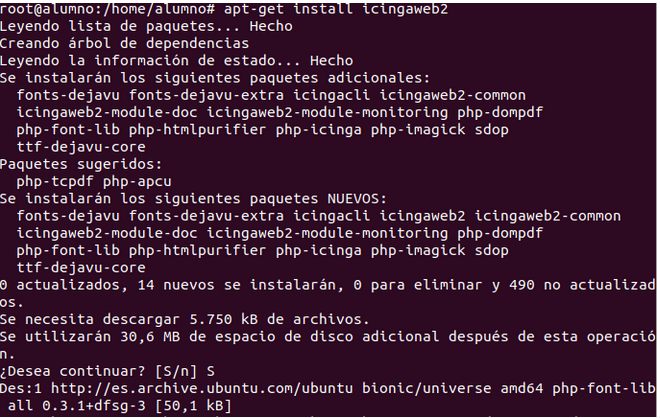

Lanzamos el comando para poder lanzar el token

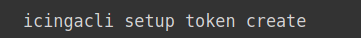

Ingresamos el token

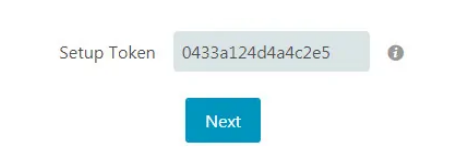

Realizamos las configuraciones pertinentes:

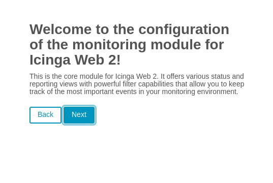

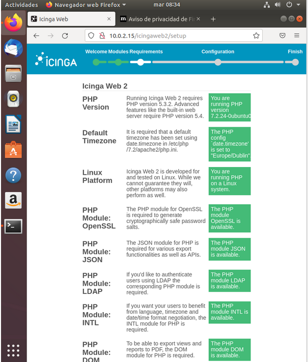

Como podemos ver en esta captura todos los pasos anteriores están correctamente

Configuramos la base de datos:

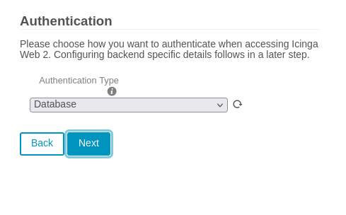

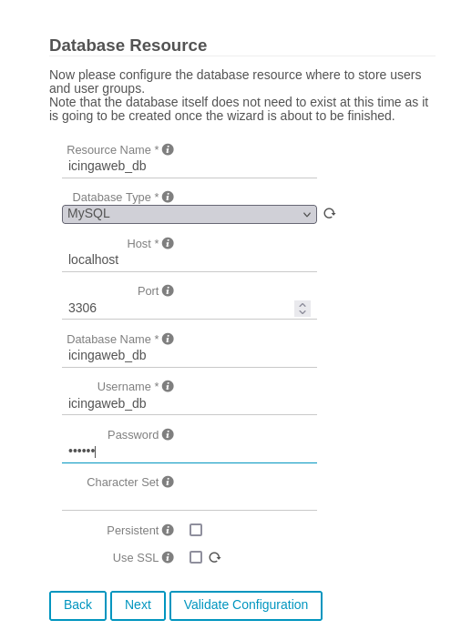

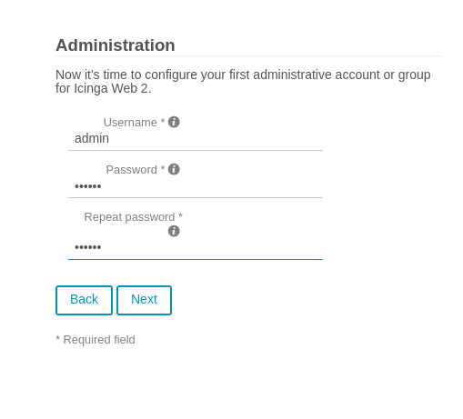

Configuracion de la cuenta de administración

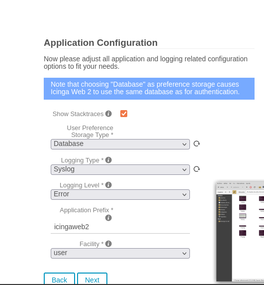

Donde se modifica la monitorización

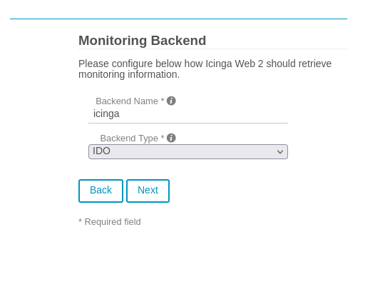

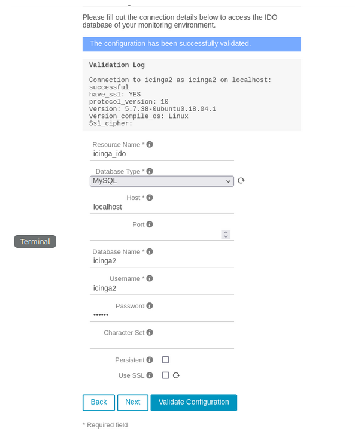

Luego te pide la ubicacion donde se enviaran los comandos

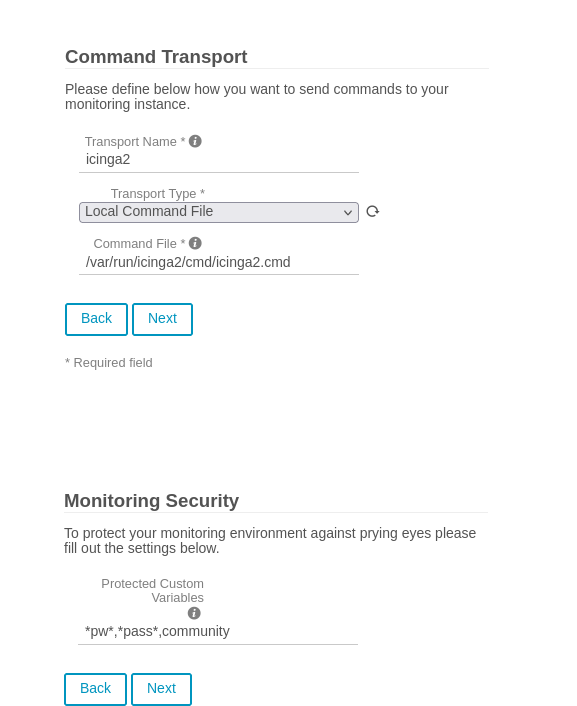

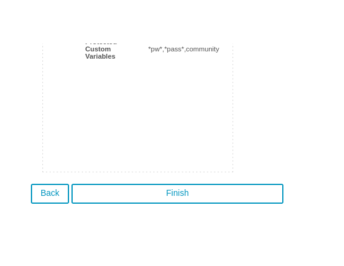

Y ya tendriamos lista la configuracion, iniciamos sesion con el usuario admin (en nuestro caso el administrador)

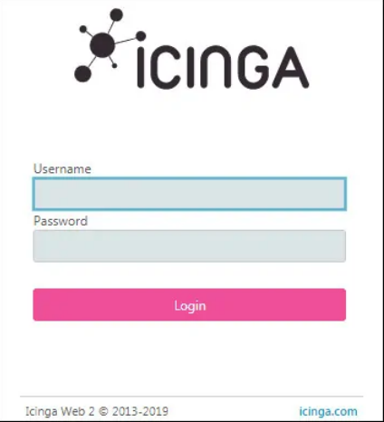

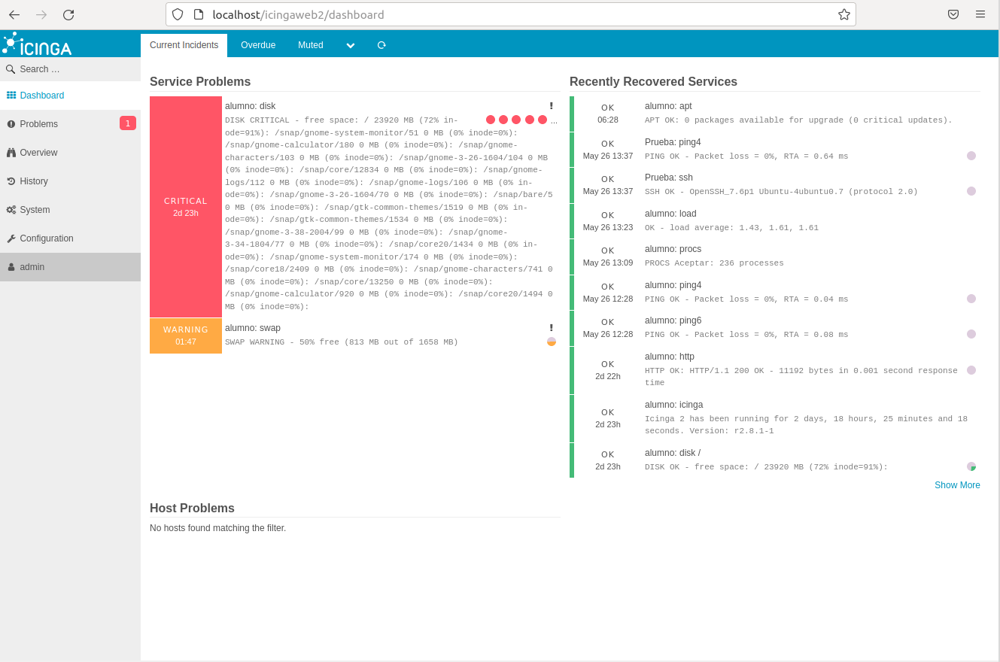

## Los recursos de hardware (CPU, RAM, disco duro) de otra máquina virtual (Windows/Linux).

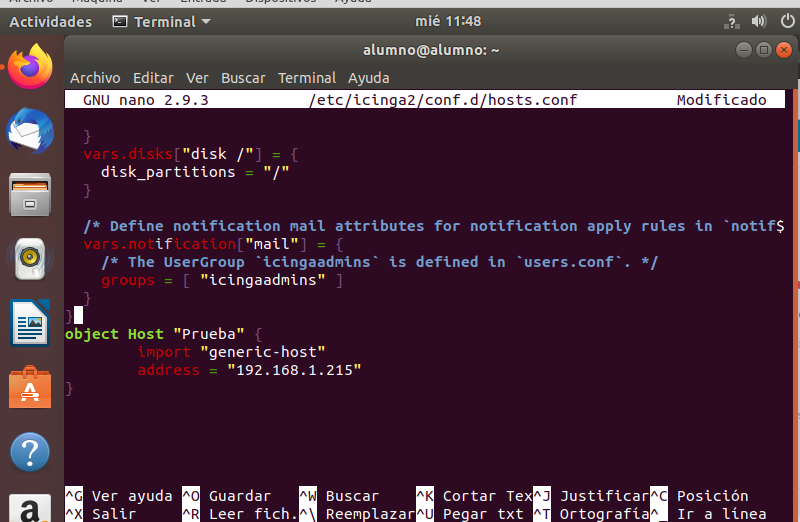

Añadimos nuestra otra máquina con su dirección IP en el fichero hosts.conf

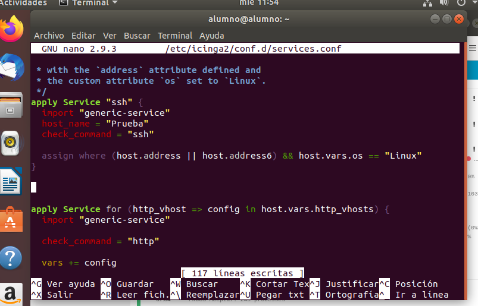

Añadimos en el services.conf el servicio que vamos a utilizar

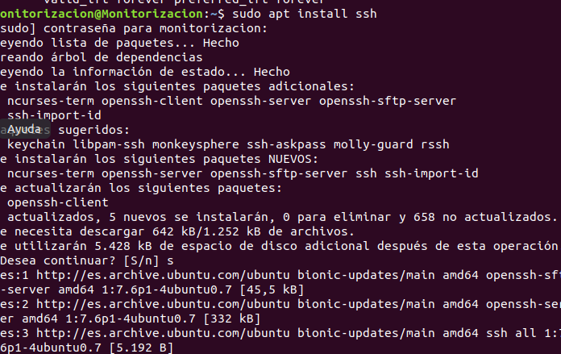

E instalamos tanto en nustra máquina donde tenemos la página web como en la otra máquina ssh ya que sino la conexión a la otra máquina no funcionará 

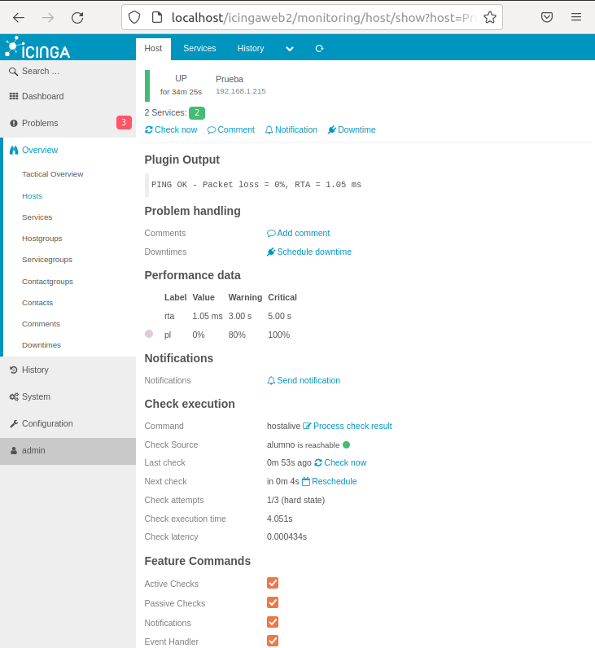 

Como podemos observar la máquina se conectó correctamente

Ahora bien para poder obtener la CPU y la RAM

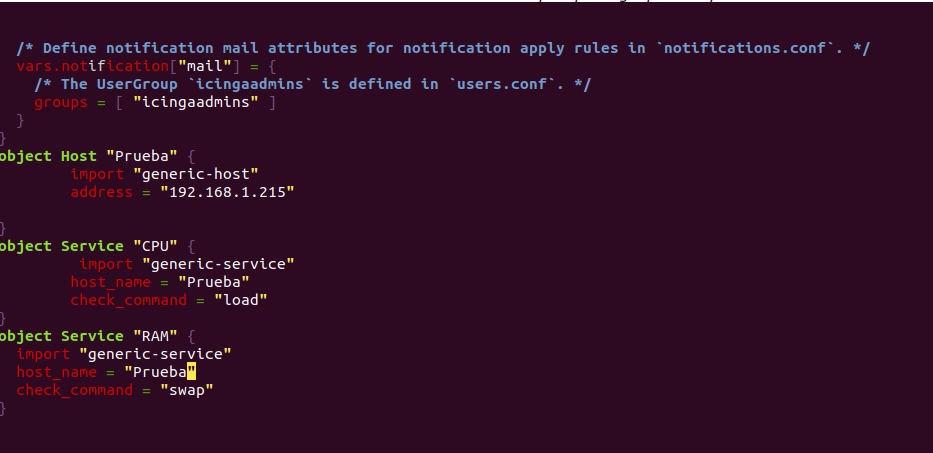
Añadimos en el fichero hosts.conf tanto la RAM como la CPU

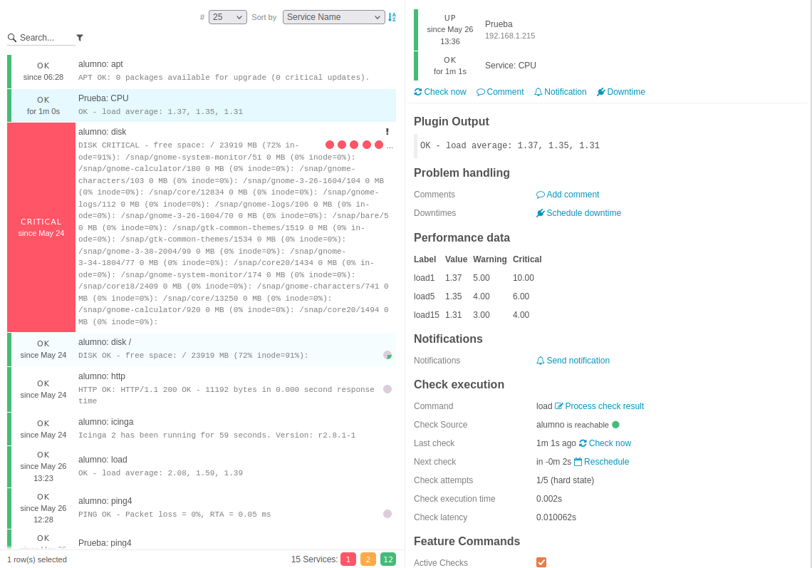
Aquí tenemos la comprobación de la CPU
## Algún servicio de red (SAMBA/SMB, FTP, SSH, HTTP, ...).

## La página web del instituto.

**Nota** 
Se deberá configurar algún mecanismo que notifique al administrador del sistema en caso de caída o fallo de algún sistema/recurso monitorizado.

