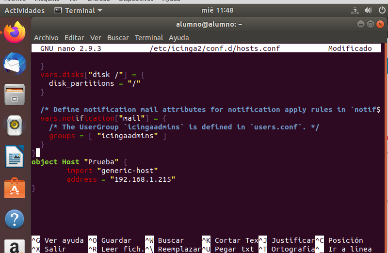
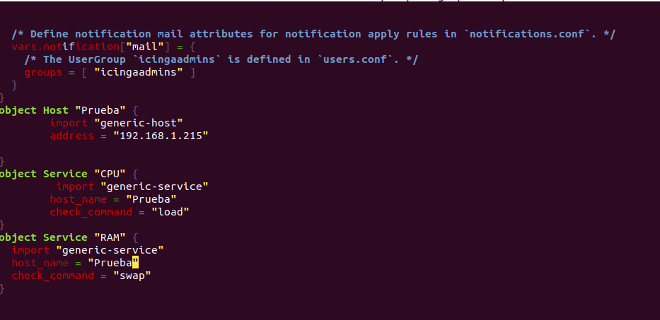

# Los recursos de hardware (CPU, RAM, disco duro) de otra máquina virtual (Windows/Linux).

- Añadimos nuestra otra máquina con su dirección IP en el fichero hosts.conf

- Añadimos en el services.conf el servicio que vamos a utilizar

- E instalamos tanto en nustra máquina donde tenemos la página web como en la otra máquina ssh ya que sino la conexión a la otra máquina no funcionará 

 

Como podemos observar la máquina se conectó correctamente

- Ahora bien para poder obtener la **CPU** y la **RAM**

- Añadimos en el **fichero hosts.conf** tanto la RAM como la CPU

Aquí tenemos la comprobación de la CPU
## Algún servicio de red (SAMBA/SMB, FTP, SSH, HTTP, ...).

## La página web del instituto.

**Nota** 
Se deberá configurar algún mecanismo que notifique al administrador del sistema en caso de caída o fallo de algún sistema/recurso monitorizado.

