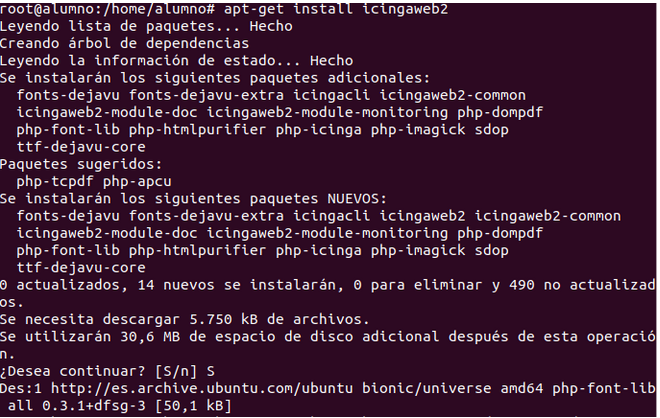
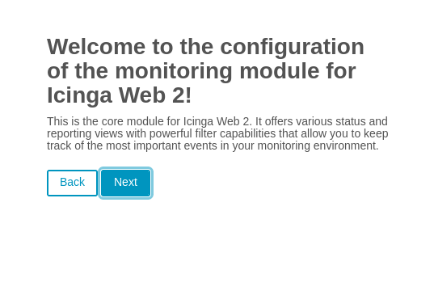
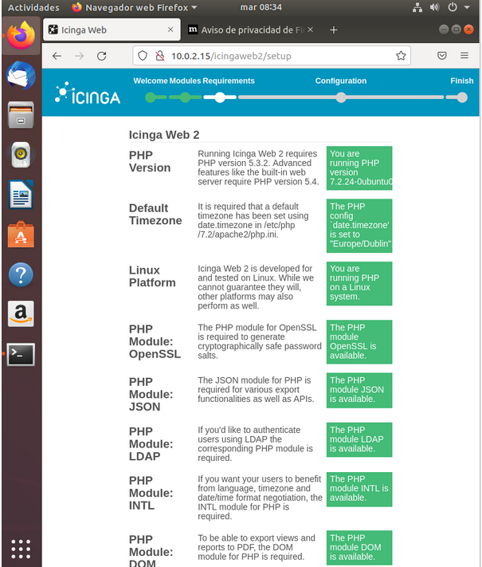
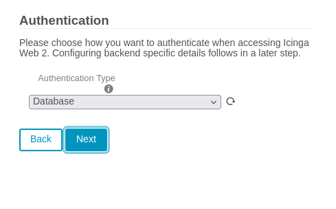
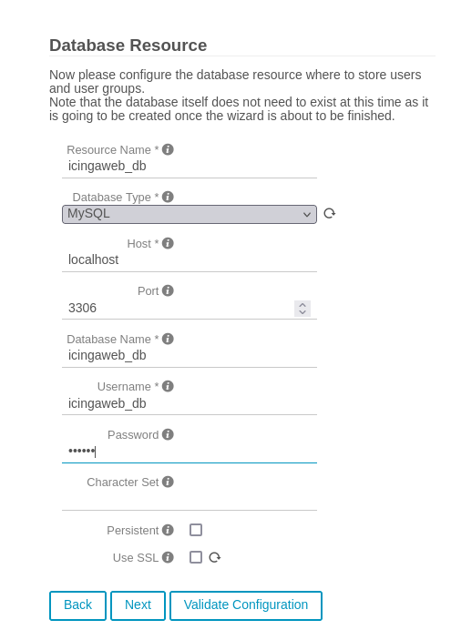
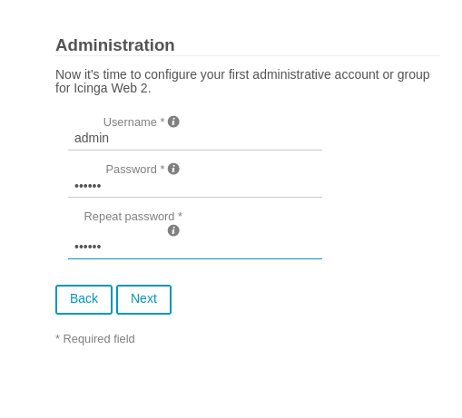
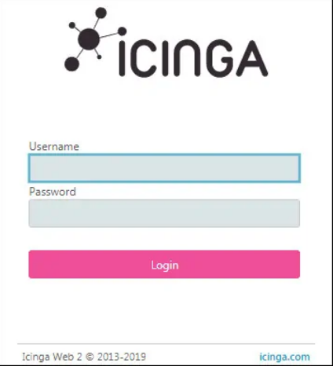
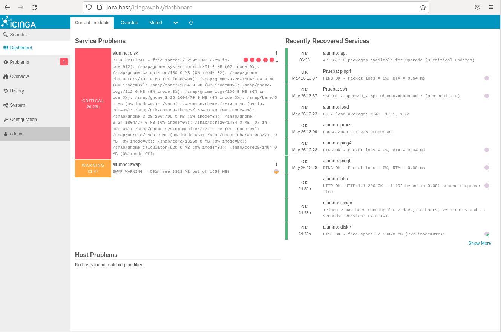

# Como instalar la web de Icinga2

- Instalamos la página web

- Lanzamos el comando para poder lanzar el token

Ingresamos el token

Realizamos las configuraciones pertinentes:

Como podemos ver en esta captura todos los pasos anteriores están correctamente

- Configuramos la base de datos:

- Configuracion de la cuenta de administración

- Donde se modifica la monitorización

- Luego te pide la ubicacion donde se enviaran los comandos

Y ya tendriamos lista la configuracion, iniciamos sesion con el usuario **admin** (en nuestro caso el administrador)

